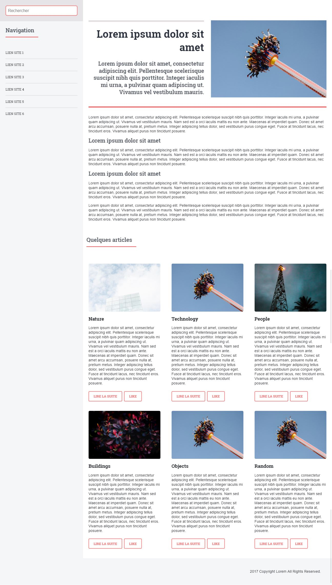

# Portfolio - Site web adaptatif
[> Page détaillé de l'exercice sur mon site <](http://neo-explorer.com/portfolio/responsive "Page de l'exercice sur mon site")

Les supports de consultation étant de plus en plus variés (ordinateurs de bureau, tablettes, smartphone, télévision…), il est important d'offrir aux utilisateurs une interface adéquate peu importe ce dernier. C'était un exercice visant à adapter l'affichage des articles d'un blog via le framework CSS : Bootstrap.

## Principe
Adapter l'affichage d'une page web en fonction de la largeur de l'écran grâce à Bootstrap. Il existe bien d'autres framework tel que Bulma ou encore Semantic UI, mais l'important ici fut de comprendre le fonctionnement des medias queries, à s'exercer à utiliser un framework et à lire et exploiter une documentation.

